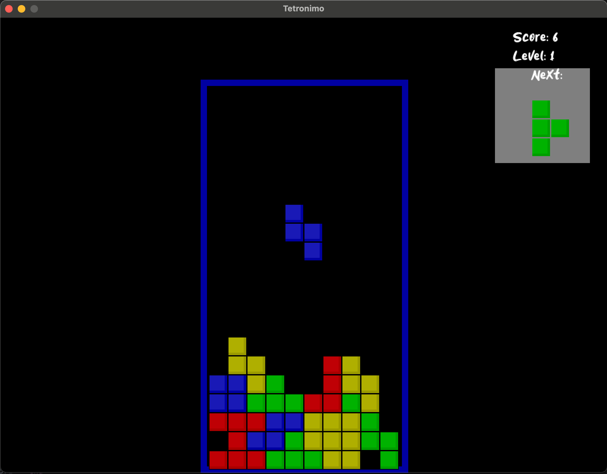

# LÖVE Tetronimo
Simple a Tetris clone written in Love2D game framework. The example is largely based on this example(https://inventwithpython.com/tetromino.py).

## Screenshot

## Addons
* [Love2D](https://love2d.org) - website of LÖVE.
* [Making Games with Python & Pygame](https://inventwithpython.com/pygame/) - great Pygame examples and a source of knowledge.
* [Juniory.tff](https://www.dafont.com/juniory.font) - dafont website
* [Gameplay](https://youtu.be/48X4Nj3GZCI) - youtube
